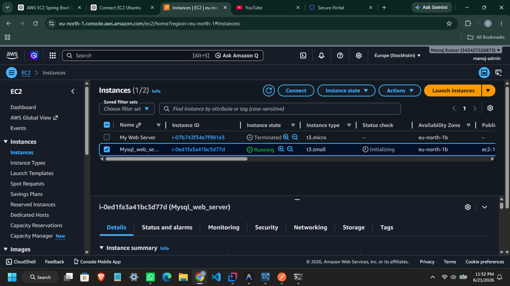
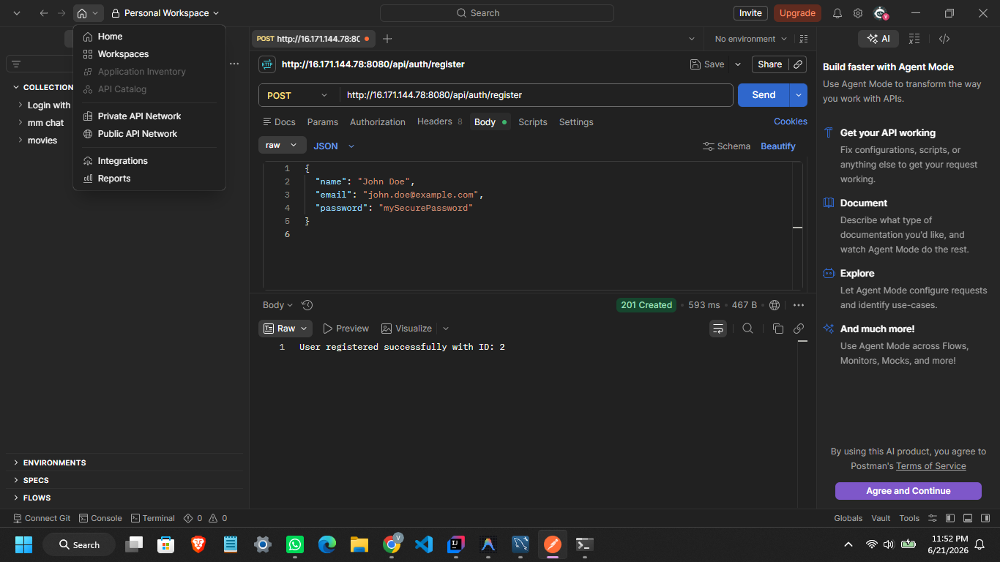
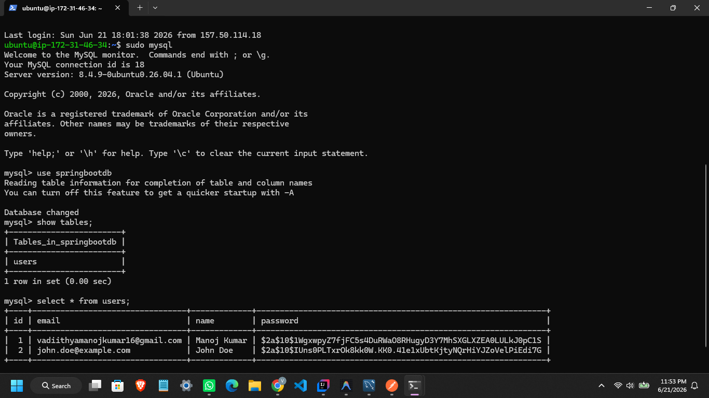
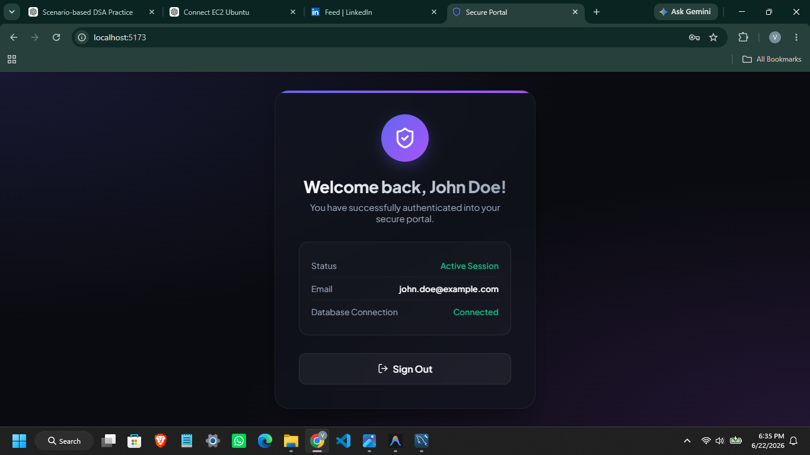

# Spring Boot User Authentication System on AWS EC2

## Project Overview

This project demonstrates the complete deployment lifecycle of a Spring Boot application on AWS Cloud. The application provides user registration and authentication functionality using Spring Boot, MySQL, and REST APIs. The entire application was deployed on an Ubuntu 24.04 LTS Amazon EC2 instance, with MySQL configured and managed directly on the server.

The main objective of this project was to gain hands-on experience in cloud computing, Linux server administration, backend application deployment, database management, networking, and API testing by moving an application from a local development environment to a cloud-hosted infrastructure.

---

## Features

- User Registration API
- User Authentication System
- RESTful API Architecture
- MySQL Database Integration
- Spring Data JPA and Hibernate
- Maven Build Management
- AWS EC2 Deployment
- Linux Server Administration
- Cloud-Based Database Hosting
- API Testing using Postman

---

## Technology Stack

### Backend
- Java 17
- Spring Boot
- Spring Data JPA
- Hibernate
- Maven

### Database
- MySQL 8

### Cloud & Infrastructure
- AWS EC2
- Ubuntu 24.04 LTS
- SSH
- Security Groups

### Testing Tools
- Postman

### Operating System
- Ubuntu 24.04 LTS

---

# Learning Journey

This project was not limited to coding. It involved understanding and implementing the complete deployment workflow from infrastructure creation to application hosting.

The following concepts were learned and implemented throughout the project:

### AWS Fundamentals

- AWS Account Creation
- AWS Security Best Practices
- Multi-Factor Authentication (MFA)
- IAM Users and Permissions
- AWS Management Console Navigation

### EC2 and Cloud Infrastructure

- Launching Amazon EC2 Instances
- Understanding Instance Types
- Configuring Security Groups
- Managing Public IP Addresses
- Connecting to EC2 via SSH
- Monitoring Instance Health

### Linux Administration

- Ubuntu Server Setup
- User Management
- Package Installation
- File System Navigation
- Service Management
- Process Monitoring

### Java Environment Setup

- Installing OpenJDK 17
- Verifying Java Installation
- Configuring Java Runtime Environment

### MySQL Administration

- Installing MySQL Server
- Creating Databases
- Creating Database Users
- Granting User Permissions
- Managing Database Connections
- Query Execution and Data Validation

### Spring Boot Deployment

- Application Packaging using Maven
- JAR File Generation
- Database Configuration
- Environment Setup
- Running Spring Boot Applications on Linux

### Networking Concepts

- Port Configuration
- HTTP Communication
- SSH Access
- API Accessibility
- Security Group Rules

---

# Deployment Process

## Step 1: AWS Account Setup

- Created AWS Account
- Configured Account Security
- Enabled MFA
- Created IAM User

## Step 2: EC2 Instance Creation

- Selected Ubuntu 24.04 LTS AMI
- Generated Key Pair
- Configured Security Groups
- Launched EC2 Instance

## Step 3: Connect to EC2

Connected securely using SSH and PEM key.

```bash
ssh -i keypair.pem ubuntu@PUBLIC_IP
```

## Step 4: Install Java 17

```bash
sudo apt update
sudo apt install openjdk-17-jdk -y
```

Verify installation:

```bash
java -version
```

## Step 5: Install MySQL

```bash
sudo apt install mysql-server -y
```

Verify MySQL service:

```bash
sudo systemctl status mysql
```

## Step 6: Configure Database

```sql
CREATE DATABASE springbootdb;

CREATE USER 'springuser'@'localhost'
IDENTIFIED BY 'StrongPassword';

GRANT ALL PRIVILEGES
ON springbootdb.*
TO 'springuser'@'localhost';

FLUSH PRIVILEGES;
```

## Step 7: Build Spring Boot Application

```bash
mvn clean package
```

Generated JAR:

```text
target/MySQL-0.0.1-SNAPSHOT.jar
```

## Step 8: Upload JAR to EC2

```bash
scp -i keypair.pem MySQL-0.0.1-SNAPSHOT.jar ubuntu@PUBLIC_IP:/home/ubuntu/
```

## Step 9: Run Application

```bash
java -jar MySQL-0.0.1-SNAPSHOT.jar
```

## Step 10: Test APIs

Used Postman to validate:

- User Registration
- Database Persistence
- API Connectivity

---

# Application Configuration

```properties
spring.datasource.url=jdbc:mysql://localhost:3306/springbootdb
spring.datasource.username=springuser
spring.datasource.password=********

spring.jpa.hibernate.ddl-auto=update
spring.jpa.show-sql=true

server.port=8080
```

---

# Project Structure

```text
src
├── main
│   ├── java
│   │   └── com.example.MySQL
│   └── resources
│       └── application.properties
│
├── test
│
pom.xml
README.md
```

---

# Deployment Validation

The deployment was successfully validated through the following checks:

### Infrastructure Validation

- AWS EC2 Instance Running
- Ubuntu Server Accessible
- Java 17 Installed
- MySQL Service Running

### Backend Validation

- Spring Boot Application Started Successfully
- REST APIs Accessible Through Public IP
- API Responses Returned Successfully

### Database Validation

- Database Created Successfully
- Tables Generated Through Hibernate
- Records Stored Successfully
- Data Retrieved Successfully

### End-to-End Validation

- Frontend Connected to Backend APIs
- Backend Connected to MySQL Database
- User Registration Flow Completed Successfully
- Data Persisted in Database

---

# Deployment Proof

## 1. AWS EC2 Instance Running

Shows the successfully running EC2 instance on AWS with Ubuntu 24.04 LTS.



---

## 2. API Successfully Accessed Through Public IP

Spring Boot REST API deployed on AWS EC2 and tested through Postman.



---

## 3. MySQL Database Running on EC2

Verification of database records stored successfully in MySQL hosted on Ubuntu EC2.



---

## 4. Frontend Successfully Connected

Frontend application successfully communicating with deployed backend APIs and MySQL database.



---

# Key Takeaways

- Understanding AWS Cloud Infrastructure
- Deploying Applications on Linux Servers
- Managing Databases in Cloud Environments
- Working with SSH and Remote Servers
- Configuring Spring Boot for Production Deployment
- Understanding Networking and Security Groups
- Testing and Validating REST APIs
- Integrating Backend Applications with Cloud Databases
- End-to-End Deployment Workflow

---

# Future Improvements

- JWT Authentication
- Docker Containerization
- CI/CD Pipeline Integration
- Nginx Reverse Proxy
- SSL/HTTPS Configuration
- Domain Name Integration
- Monitoring and Logging

---

## Author

**Manoj Kumar**

Computer Science Engineering Student

Passionate about Backend Development, Cloud Computing, Java, Spring Boot, and Software Engineering.

---
